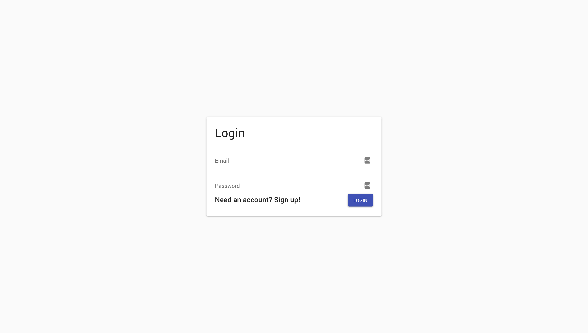
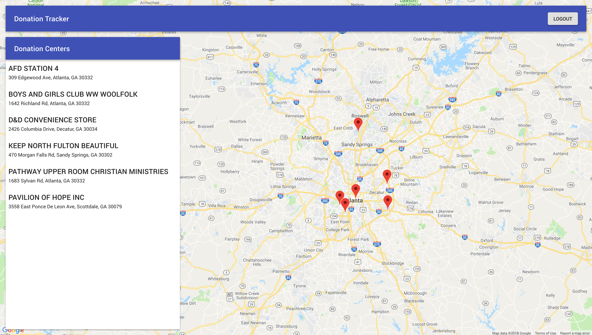
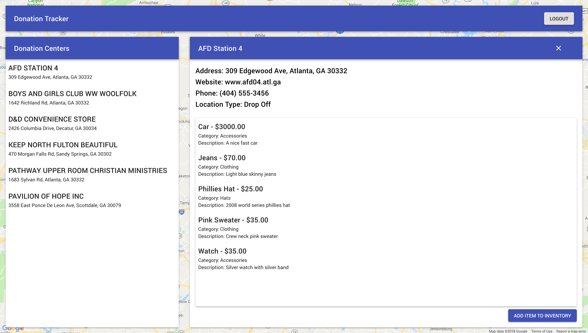
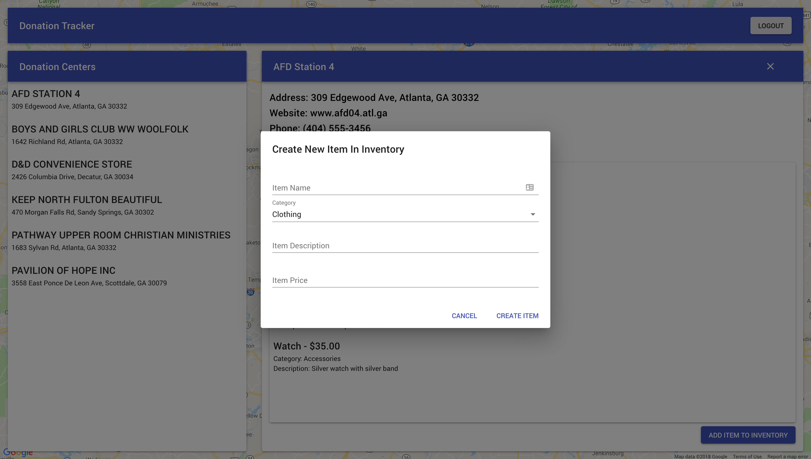

# Donation Tracker React

A version of our CS-2340 Donation Tracker Android app in React to offer web support.
[You can find our original project here.](https://github.com/benmelnick/DonationTracker)

## Use
1. In the project directory, run: npm install
2. Follow the instructions in "example.env"
3. In the project directory, run: npm start

----

